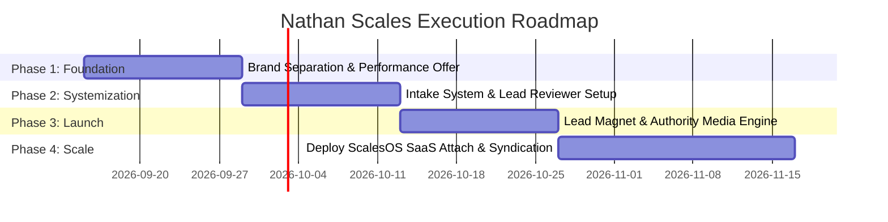

# NATHAN SCALES DIGITAL STUDIO — STRATEGIC BUSINESS MODEL & GROWTH ENGINE
> **An Enterprise Blueprint for High-Margin Client Acquisition, B2B Engineering Authority, and Productized Revenue**
> *Rooted in Modern Web Architecture, Automated Lead Ops ([docs/lead_research.md](file:///E:/nate/GEMINI_AGENT/Nathan-Scales/docs/lead_research.md)), and Performance-Driven Commercial Systems ([README.md](file:///E:/nate/GEMINI_AGENT/Nathan-Scales/README.md))*

---

## ⚡ 1. EXECUTIVE SUMMARY & STRATEGIC VISION

Traditional web agencies and marketing firms operate on a broken, high-churn model: selling static websites for one-off fees or charging hefty monthly retainers before delivering proven commercial results. 

**Nathan Scales Digital Studio** bridges the gap between high-end digital studio engineering (React 19, Vite, Motion) and automated B2B client acquisition. By unifying high-converting web presences, automated multi-signal lead research ([docs/lead_reviewer.md](file:///E:/nate/GEMINI_AGENT/Nathan-Scales/docs/lead_reviewer.md)), and performance-backed growth contracts, Nathan Scales operates as a **revenue-first digital studio**.

This master playbook details the 5 pillars of the Nathan Scales growth architecture:

```
                      +-------------------------------------------------+
                      |     AUTHORITY BRAND: Nathan Scales (@nathanscales) |
                      | Technical breakdowns, AI lead ops, web systems  |
                      +------------------------+------------------------+
                                               |
                        +----------------------+----------------------+
                        |                                             |
                        v                                             v
+---------------------------------------+     +---------------------------------------+
|  COMMERCIAL STUDIO (Client Engine)    |     |  SCALES ACADEMY (Growth Ecosystem)    |
|  - Ultra-focused B2B positioning      |     |  - Free B2B Lead Generator Blueprint  |
|  - Qualified Pipeline Performance     |     |  - Free Interactive Site Audit        |
|  - Enterprise B2B client contracts    |     +-------------------+-------------------+
+-------------------+-------------------+                         |
                    |                                             v
                    |                         +---------------------------------------+
                    |                         |  SCALES GROWTH ACCELERATOR            |
                    |                         |  - Done-With-You Agency Incubation    |
                    |                         |  - Tech-enabled growth mentorship     |
                    |                         +-------------------+-------------------+
                    |                                             |
                    +----------------------+----------------------+
                                           |
                                           v
                  +-------------------------------------------------+
                  |      PRODUCTIZED ENGINE: ScalesOS / Jarvis      |
                  | Multi-signal lead research, custom intake,      |
                  | and Resend CRM sync ($197 - $297/mo MRR)        |
                  +-------------------------------------------------+
```

---

## 🏛️ 2. THE DUAL-ENTITY BRAND ARCHITECTURE

To establish market dominance, Nathan Scales separates public authority building from quiet, high-ticket client execution.

```
                          NATHAN SCALES ECOSYSTEM
                                     │
           ┌─────────────────────────┴─────────────────────────┐
           ▼                                                   ▼
┌───────────────────────────────┐           ┌───────────────────────────────┐
│   TECHNICAL AUTHORITY BRAND   │           │   COMMERCIAL STUDIO BRAND     │
│       "Nathan Scales"         │           │ "Nathan Scales Digital Studio"│
├───────────────────────────────┤           ├───────────────────────────────┤
│ • Public engineering persona  │           │ • Minimalist, high-ticket     │
│ • Builds top-of-funnel reach  │           │   commercial destination      │
│ • Live code & lead ops demos  │           │ • Frictionless intake overlay │
│ • Channels: X, LinkedIn, YT   │           │ • Performance & rev-share     │
└───────────────────────────────┘           └───────────────────────────────┘
```

### Pillar A: The Technical Authority Persona (`@nathanscales`)
* **Core Function:** Drive organic awareness, establish engineering superiority, and generate inbound project inquiries.
* **Content Mix:**
  1. **Engineering Teardowns:** Showing how modern React 19 + Motion web architectures outperform legacy agency sites.
  2. **Lead Intelligence Demos:** Screen-shares of automated multi-signal B2B prospecting tools in action.
  3. **Commercial Playbook Analysis:** Case studies showing how enterprise B2B companies (e.g., construction, logistics, manufacturing) capture USD contract leads ([docs/uganda_construction_leads_outreach_playbook.md](file:///E:/nate/GEMINI_AGENT/Nathan-Scales/docs/uganda_construction_leads_outreach_playbook.md)).
* **Bio Strategy:** Direct, high-authority positioning pointing to the primary client intake overlay.

### Pillar B: Nathan Scales Digital Studio
* **Core Function:** Execute high-value commercial engagements for enterprise B2B clients.
* **Platform Experience:** Fast, editorial React 19 single-page platform featuring non-disruptive discovery overlays ([README.md](file:///E:/nate/GEMINI_AGENT/Nathan-Scales/README.md)).
* **Core Positioning Statement:**
  > *"We don't build decorative websites. We engineer high-converting digital presences and automated lead acquisition pipelines tied directly to verified revenue."*

---

## 💼 3. THE QUALIFIED PIPELINE PERFORMANCE OFFER

Nathan Scales eliminates traditional client acquisition friction by shifting from rigid upfront retainers to a **Risk-Reversed Pipeline Performance Model**.

```
+-----------------------------------------------------------------------------------+
|                     THE NATHAN SCALES PERFORMANCE CONTRACT                        |
+-----------------------------------------------------------------------------------+
|  "We design and build your enterprise web platform and deploy a custom B2B        |
|   lead acquisition system. You pay a low baseline infrastructure setup fee,       |
|   followed by a performance fee tied strictly to qualified contract inquiries    |
|   delivered directly into your CRM."                                              |
+-----------------------------------------------------------------------------------+
```

### Inbound & Intake Architecture
1. **Inbound Prospect Intake:** Inquiries from personal brand content or outreach enter through the **Client Discovery Overlay** on the Nathan Scales platform.
2. **Automated Verification Pipeline:**
   - Lead responses stream instantly to Google Sheets.
   - Background tasks run `lead_research.md` and `lead_reviewer.md` to evaluate prospect scale, ad activity, and budget signal.
   - Qualified leads trigger automated Resend API welcome sequences ([docs/Agency_tasks.md](file:///E:/nate/GEMINI_AGENT/Nathan-Scales/docs/Agency_tasks.md)) and schedule discovery calls.

---

## 🎓 4. ECOSYSTEM MONETIZATION: MAGNET TO ACCELERATOR

To monetise non-agency audience traffic (developers, emerging agency owners, growth leads), Nathan Scales deploys a productized education and incubator ladder.

```
[ Cold Organic Attention ]
            │
            ▼
[ Free Lead Magnet: go.nathanscales.com ]
  - Free B2B Lead Acquisition Blueprint
  - Automated Business Audit Tool
            │
            ▼
[ Scales Growth Accelerator ]
  - $1,500 - $3,500 DWY (Done-With-You) Program
  - Teaches Devs & Agencies to build Lead Ops + Web Platforms
            │
            ▼
[ Productized SaaS Attach: ScalesOS ]
  - $197/month recurring tool suite for active members
```

### 1. The Value Magnet (`go.nathanscales.com`)
* **Offer:** *"The B2B Growth Engine Blueprint: How to Automate Prospect Research & Qualify Enterprise Clients Without Cold Calling."*
* **Delivery:** Interactive video training + downloadable lead scoring protocols.

### 2. The Scales Growth Accelerator
* **Target Audience:** Web developers, freelance marketers, and agency operators.
* **Curriculum:**
  - Modern Digital Studio Stack (React 19, Tailwind v4, Motion).
  - Multi-Signal Lead Intelligence Engine Architecture.
  - Automated Client Intake & Resend Email Pipelines.
* **Delivery:** Invite-only incubator with structured implementation calls.

---

## ⚙️ 5. PRODUCTIZED INFRASTRUCTURE: SCALES OS / JARVIS

The core financial engine of Nathan Scales is the productization of its internal software stack into **ScalesOS / Jarvis Intelligence Suite**.

```
+-----------------------------------------------------------------------------------+
|                        SCALES OS / JARVIS SOFTWARE SUITE                          |
+-----------------------------------------------------------------------------------+
|  1. In-Page Client Discovery Overlay                                              |
|     Non-disruptive, keyboard-navigable intake widget for instant qualification.   |
|                                                                                   |
|  2. Multi-Signal Lead Intelligence Engine                                         |
|     Automated scrapers & AI reviewers checking ad spend, digital activity,       |
|     and operating signals.                                                        |
|                                                                                   |
|  3. Resend API & CRM Pipeline Sync                                                |
|     Automated notification and sequence trigger engine.                           |
|                                                                                   |
|  TIERS: Standard ($197/month) | Enterprise ($297/month)                           |
+-----------------------------------------------------------------------------------+
```

### Strategic MRR Lock-In:
* **Agency Clients:** Required operational stack attached to performance contracts.
* **Accelerator Members:** Adopt ScalesOS to power their own client intake and lead ops, creating reliable **Monthly Recurring Revenue (MRR)** for Nathan Scales.

---

## 📢 6. MEDIA SYNDICATION NETWORK

To maintain omnipresence across digital channels without manual posting overhead:

1. **Content Repository:** Raw screen recordings of web development, UI animations, and automated lead research are logged during regular work.
2. **Syndication Partners:** Community members and short-form creators receive access to raw footage and teardown templates.
3. **Performance Distribution:** Creators are rewarded based on traffic and conversions generated for `go.nathanscales.com` using unique referral tags.

---

## 🗓️ 7. 90-DAY IMPLEMENTATION ROADMAP



### Milestone Checklist

#### Phase 1: Brand Foundation & Performance Offer (Weeks 1–2)
- [x] Analyze agency strategy and structure core growth thesis.
- [ ] Configure personal channel (`@nathanscales`) and studio destination.
- [ ] Package the **Qualified Pipeline Performance Contract** for targeted B2B sectors.
- [ ] Align platform positioning on [README.md](file:///E:/nate/GEMINI_AGENT/Nathan-Scales/README.md).

#### Phase 2: Lead Systems & Intake Automation (Weeks 3–4)
- [ ] Refine in-page client intake overlay on the main web platform ([docs/Tasks.md](file:///E:/nate/GEMINI_AGENT/Nathan-Scales/docs/Tasks.md)).
- [ ] Connect Resend API for instant onboarding sequences.
- [ ] Enable automated lead review workflows via [lead_reviewer.md](file:///E:/nate/GEMINI_AGENT/Nathan-Scales/docs/lead_reviewer.md) for Google Sheet entries.

#### Phase 3: Growth Magnet & Authority Engine (Weeks 5–6)
- [ ] Record 3 technical build breakdowns for YouTube & LinkedIn.
- [ ] Deploy `go.nathanscales.com` lead magnet page.
- [ ] Execute targeted outreach sequences for priority B2B leads ([docs/uganda_construction_leads_outreach_playbook.md](file:///E:/nate/GEMINI_AGENT/Nathan-Scales/docs/uganda_construction_leads_outreach_playbook.md)).

#### Phase 4: Productized ScalesOS & Syndication (Weeks 7–12)
- [ ] Package intake overlay + lead intelligence engine into **ScalesOS** ($197/mo).
- [ ] Open enrollment for the **Scales Growth Accelerator**.
- [ ] Launch the **Scales Media Syndication Network** for automated content distribution.

---

## 🎯 SUMMARY OF COMMERCIAL ADVANTAGES

1. **Zero Reliance on Cold Spam:** Inbound volume generated by personal engineering authority.
2. **High Close Rates:** Performance hybrid contracts eliminate prospect risk.
3. **Durable Software Revenue:** ScalesOS generates recurring monthly income independent of agency project cycles.
4. **Scalable Media Distribution:** Syndicated content network guarantees organic reach across platforms.

*© Nathan Scales Digital Studio. All rights reserved.*
